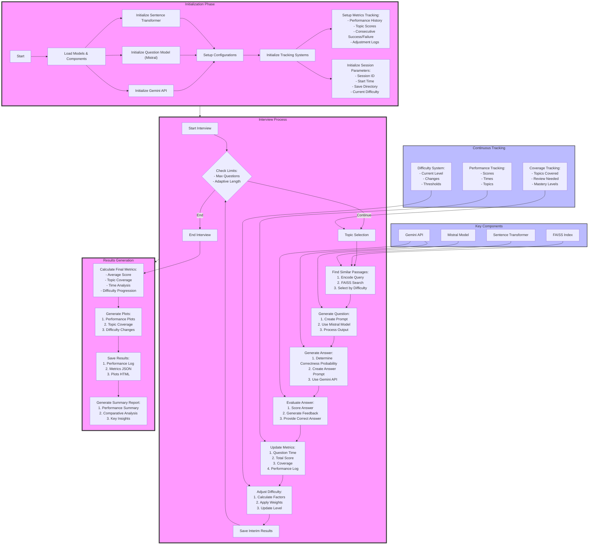

# Interview Pipeline

# Advanced AI Interview Pipeline Documentation

## Table of Contents
- [Overview](#overview)
- [Initialization](#initialization)
- [Interview Process](#interview-process)
- [Performance Types](#performance-types)
- [Difficulty Adjustment System](#difficulty-adjustment-system)
- [Topic Management](#topic-management)
- [Evaluation System](#evaluation-system)
- [Metrics and Analytics](#metrics-and-analytics)
- [Results and Artifacts](#results-and-artifacts)
- [Data Storage](#data-storage)

## Overview

The AI Interview Pipeline is a sophisticated system designed to conduct adaptive technical interviews using multiple AI models. It simulates different interviewer personalities (good, mediocre, poor) and automatically adjusts difficulty based on candidate performance.

## Initialization

### Model Loading
1. **Sentence Transformer**
   - Model: 'all-MiniLM-L6-v2'
   - Used for: Passage similarity search and embedding generation
   - Configuration: Default parameters for efficient embedding

2. **Question Generation Model**
   - Model: Mistral-7B with custom fine-tuning
   - Configuration:
     - Max sequence length: 700
     - Temperature: 0.7
     - Top-p: 0.9
     - Top-k: 50

3. **Answer Evaluation Model**
   - Model: Google's Gemini Pro
   - Used for: Answer generation and evaluation
   - Temperature: 0.7 for controlled randomness

### Initial Setup
1. **Session Parameters**
   - Unique session ID (timestamp-based)
   - Interview type selection
   - Initial difficulty level (default: medium)
   - Save directory creation

2. **Tracking Systems**
   - Performance history array
   - Topic coverage tracking
   - Difficulty adjustment logs
   - Time tracking initialization

## Interview Process

### Question Generation Flow
1. **Topic Selection**
   - Check uncovered topics
   - Verify topic distribution
   - Consider topics needing review
   - Balance new vs review topics

2. **Passage Selection**
   - Generate topic embedding
   - FAISS similarity search (k=3)
   - Filter by current difficulty
   - Select most relevant passage

3. **Question Creation**
   ```python
   prompt = f"""
   Topic: {topic}
   Subtopic: {subtopic}
   Difficulty: {difficulty}
   Passage: {passage}
   Question:
   """
   ```

## Performance Types

### Good Interview Type
- **Correct Answer Probability**: 70%
- **Score Ranges**:
  - Correct answers: 0.8-1.0
  - Incorrect answers: 0.3-0.5
- **Characteristics**:
  - High-quality explanations
  - Minimal irrelevant information
  - Proper terminology usage
  - Comprehensive coverage

### Mediocre Interview Type
- **Correct Answer Probability**: 50%
- **Score Ranges**:
  - Correct answers: 0.6-0.8
  - Incorrect answers: 0.2-0.4
- **Characteristics**:
  - Mixed quality explanations
  - Some irrelevant information
  - Occasional terminology errors
  - Partial topic coverage

### Poor Interview Type
- **Correct Answer Probability**: 10%
- **Score Ranges**:
  - Correct answers: 0.4-0.6
  - Incorrect answers: 0.0-0.2
- **Characteristics**:
  - Low-quality explanations
  - Significant irrelevant content
  - Frequent terminology errors
  - Incomplete coverage

## Difficulty Adjustment System

### Factors Considered
1. **Recent Performance** (35% weight)
   - Last 3 questions' scores
   - Trend analysis
   - Moving average calculation

2. **Topic Mastery** (25% weight)
   - Per-topic average scores
   - Coverage completeness
   - Review frequency

3. **Consecutive Performance** (25% weight)
   - Success streaks (≥2 correct)
   - Failure streaks (≥2 incorrect)
   - Pattern recognition

4. **Overall Session** (15% weight)
   - Average session score
   - Time-based performance
   - Difficulty progression

### Adjustment Rules
```python
def _get_final_difficulty(weighted_score):
    if weighted_score >= 1.5:
        return 'hard'
    elif weighted_score >= 0.5:
        return 'medium'
    else:
        return 'easy'
```

### Stability Mechanisms
1. **Hysteresis Prevention**
   - Minimum questions per difficulty: 2
   - Required score difference: 0.2
   - Cooldown period between changes

2. **Topic-Based Stability**
   - Topic mastery threshold: 0.8
   - Maximum consecutive same topic: 3
   - Topic difficulty correlation

## Topic Management

### Coverage Tracking
1. **Topic Registry**
   - Main topics and subtopics
   - Completion status
   - Review flags
   - Mastery levels

2. **Selection Algorithm**
   ```python
   def select_next_topic():
       if len(covered_topics) >= total_topics:
           reset_coverage()
       return priority_queue.get_next_topic()
   ```

3. **Review System**
   - Topics below threshold marked for review
   - Spaced repetition implementation
   - Mastery-based scheduling

## Evaluation System

### Answer Assessment
1. **Scoring Components**
   - Content accuracy
   - Completeness
   - Relevance
   - Terminology usage

2. **Feedback Generation**
   - Specific error identification
   - Improvement suggestions
   - Correct answer explanation
   - Score justification

3. **Score Normalization**
   - Interview type consideration
   - Difficulty level adjustment
   - Consistency checking

## Metrics and Analytics

### Real-time Metrics
1. **Performance Metrics**
   - Running average score
   - Topic-wise performance
   - Time per question
   - Difficulty progression

2. **Coverage Metrics**
   - Topics completed
   - Review frequency
   - Mastery levels
   - Gap analysis

### Generated Plots

1. **Performance Plots**
   - Score progression line chart
   - Time per question trend
   - Difficulty changes
   - Topic mastery heat map

2. **Topic Analysis**
   - Coverage sunburst chart
   - Performance radar chart
   - Review frequency histogram
   - Mastery progression

3. **Comparative Analysis**
   - Interview type comparisons
   - Difficulty distribution
   - Time efficiency analysis
   - Error pattern analysis

## Results and Artifacts

### Saved Results
1. **Session Data**
   ```json
   {
     "session_id": "20241222_123456",
     "interview_type": "mediocre",
     "metrics": {
       "total_score": 0.75,
       "questions_asked": 15,
       "average_time": 120.5,
       "topic_coverage": 0.8
     }
   }
   ```

2. **Detailed Logs**
   - Question-answer pairs
   - Timing information
   - Score breakdowns
   - Feedback details

3. **Analytics Reports**
   - Performance summary
   - Topic coverage analysis
   - Time efficiency report
   - Improvement suggestions

### Generated Files
1. **HTML Reports**
   - Interactive plots
   - Session summary
   - Detailed analysis
   - Performance breakdown

2. **JSON Data**
   - Raw metrics
   - Question details
   - Performance logs
   - Configuration data

3. **Plot Files**
   - Performance visualizations
   - Topic coverage charts
   - Comparative analysis
   - Time series analysis

## Data Storage

### Directory Structure
```
interview_results/
├── session_id/
│   ├── plots/
│   │   ├── performance_plots.html
│   │   ├── topic_coverage.html
│   │   └── difficulty_changes.html
│   ├── metrics.json
│   ├── performance_log.json
│   └── summary_report.txt
└── comparison/
    ├── comparative_analysis.html
    ├── combined_metrics.json
    └── summary_report.txt
```

### Storage Format
1. **Metrics JSON**
   - Session parameters
   - Performance metrics
   - Coverage statistics
   - Time analytics

2. **Performance Log**
   - Detailed question records
   - Response tracking
   - Score calculations
   - Timing data

3. **Summary Report**
   - Overall performance
   - Key insights
   - Recommendations
   - Comparative analysis
