88# RAG-Based Question Generation and Evaluation System Documentation

```mermaid
%%{
  init: {
    'theme': 'base',
    'themeVariables': {
      'primaryColor': '#f0f7ff',
      'primaryTextColor': '#333',
      'primaryBorderColor': '#1b5e20',
      'lineColor': '#1b5e20',
      'fontSize': '16px'
    }
  }
}%%

flowchart TB
    %% Define styles
    classDef dataStyle fill:#e1f5fe,stroke:#01579b,stroke-width:2px
    classDef ragStyle fill:#f3e5f5,stroke:#4a148c,stroke-width:2px
    classDef modelStyle fill:#fff3e0,stroke:#e65100,stroke-width:2px
    classDef evalStyle fill:#e8f5e9,stroke:#1b5e20,stroke-width:2px
    classDef processStyle fill:#fbe9e7,stroke:#bf360c,stroke-width:2px
    classDef defaultStyle fill:#fff,stroke:#333,stroke-width:2px,font-family:Arial

    %% Data Processing Section
    subgraph Data["📊 Data Processing & Storage"]
        MainCSV["Main Dataset CSV<br><hr>• Passages<br>• Questions<br>• Topics<br>• Source: pass_QA_topic_stopic_diff.csv"]
        MappingCSV["Mapping Dataset CSV<br><hr>• Topic<br>• Sub-Topic<br>• Difficulty<br>• Source: Untitled spreadsheet - Sheet1.csv"]
    end

    %% RAG System Section
    subgraph RAG["🔍 RAG System (RAGRetriever Class)"]
        direction TB
        Init["Initialization<br><hr>• Embedding Model: all-MiniLM-L6-v2<br>• Vector Dimension: Model Output Size<br>• Architecture: SentenceTransformer"]
        FAISS["FAISS Index Configuration<br><hr>• Index Type: IndexFlatL2<br>• Search: Exact KNN<br>• Distance Metric: L2<br>• Dimension: Embedding Size"]
        Embed["Passage Embeddings<br><hr>• Framework: SentenceTransformer<br>• Precision: Float32<br>• Storage: NumPy Arrays"]
        
        Init --> Embed
        Embed --> FAISS
    end

    %% Model Generation Section
    subgraph ModelGen["🤖 Question Generation Engine"]
        direction TB
        GemmaBase["Base Model Configuration<br><hr>• Model: google/gemma-2b<br>• Precision: Float16<br>• Device: Auto Mapping<br>• Framework: HuggingFace"]
        PEFT["PEFT Adaptation<br><hr>• Method: LoRA Fine-tuning<br>• Weight Merging: Enabled<br>• Adapter Integration: Post-training"]
        GenParams["Generation Parameters<br><hr>• Max Sequence Length: 512<br>• Temperature: 0.7<br>• Top-p (Nucleus): 0.9<br>• Top-k: 50<br>• Return Sequences: 1"]
        
        GemmaBase --> PEFT
        PEFT --> GenParams
    end

    %% Evaluation Section
    subgraph Eval["📈 Multi-Metric Evaluation System"]
        direction TB
        BLEU["BLEU Score Metrics<br><hr>• Variants: BLEU-1 to BLEU-4<br>• Tokenization: Word-level<br>• Case Sensitivity: Insensitive<br>• Framework: NLTK"]
        ROUGE["ROUGE Score Analysis<br><hr>• Types: ROUGE-1, 2, L<br>• Stemming: Enabled<br>• Metrics: Precision/Recall/F1<br>• Framework: rouge-scorer"]
        BERT["BERT Score Evaluation<br><hr>• Language Model: en<br>• Metrics: P/R/F1<br>• Aggregation: Mean<br>• Framework: bert-score"]
        
        BLEU --> Metrics["Final Metrics Output<br><hr>• Format: CSV<br>• Metrics: Combined<br>• Statistics: Mean/Std"]
        ROUGE --> Metrics
        BERT --> Metrics
    end

    %% Process Flow Section
    subgraph Process["⚡ Processing Pipeline"]
        direction TB
        Filter["1. Data Filtering<br><hr>• By Topic<br>• By Subtopic<br>• By Difficulty"]
        Retrieve["2. Passage Retrieval<br><hr>• Method: FAISS KNN<br>• Embedding Lookup<br>• Similarity Matching"]
        Generate["3. Question Generation<br><hr>• Model: Fine-tuned Gemma<br>• Context: Retrieved Passage<br>• Format: Single Question"]
        Evaluate["4. Quality Evaluation<br><hr>• Multiple Metrics<br>• Reference Comparison<br>• Score Aggregation"]
    end

    %% Connect Components
    Data --> RAG
    RAG --> Process
    ModelGen --> Process
    Process --> Eval

    %% Apply Styles
    class Data dataStyle
    class RAG ragStyle
    class ModelGen modelStyle
    class Eval evalStyle
    class Process processStyle
```




## 1. System Overview
This system implements a comprehensive pipeline for generating and evaluating questions using a RAG (Retrieval-Augmented Generation) approach combined with fine-tuned language models. The system processes passages, generates relevant questions, and evaluates them using multiple metrics.

## 2. Data Processing & Storage

### 2.1 Input Data Structure
#### Main Dataset (pass_QA_topic_stopic_diff.csv)
- **Content**: Contains primary data for question generation
- **Columns**:
  - ID: Unique identifier for each entry
  - Topic: Main subject area
  - Sub-Topic: Specific area within the main topic
  - Passage: Source text for question generation
  - Difficulty: Complexity level of the content
  - Question: Reference questions
  - Answer: Corresponding answers

#### Mapping Dataset (Mapping CSV)
- **Purpose**: Maps relationships between topics, subtopics, and difficulty levels
- **Structure**:
  - Topic: Primary subject classification
  - Sub-Topic: Secondary classification
  - Difficulty: Standardized difficulty rating

## 3. RAG System Implementation

### 3.1 Embedding System
- **Model**: SentenceTransformer (all-MiniLM-L6-v2)
  - Architecture: Transformer-based
  - Output Dimension: Model-specific embedding size
  - Precision: Float32 for maximum accuracy

### 3.2 FAISS Index Configuration
- **Index Type**: IndexFlatL2
  - Search Method: Exact K-Nearest Neighbors
  - Distance Metric: L2 (Euclidean distance)
  - Storage Format: Dense vector matrix
- **Performance Characteristics**:
  - Exact search (no approximation)
  - Linear time complexity O(n)
  - Suitable for medium-sized datasets

### 3.3 RAGRetriever Class Implementation
```python
class RAGRetriever:
    def __init__(self, main_csv, mapping_csv, embedding_model='all-MiniLM-L6-v2')
```
- Initializes embedding model
- Processes all passages into embeddings
- Creates and populates FAISS index
- Manages data filtering and retrieval operations

## 4. Question Generation Engine

### 4.1 Base Model Configuration
- **Model**: google/gemma-2b
  - Precision: Float16 for efficient inference
  - Device Mapping: Automatic based on hardware
  - Framework: HuggingFace Transformers

### 4.2 PEFT (Parameter-Efficient Fine-Tuning)
- **Method**: LoRA (Low-Rank Adaptation)
  - Weight Merging: Enabled post-training
  - Integration: Adapter-based approach
  - Memory Efficiency: Optimized for deployment

### 4.3 Generation Parameters
- **Configuration**:
  - Maximum Length: 512 tokens
  - Temperature: 0.7 (balanced creativity)
  - Top-p (Nucleus Sampling): 0.9
  - Top-k: 50
  - Number of Return Sequences: 1
- **Prompt Structure**:
  ```
  Generate a concise single question based on the following passage:
  Topic: {topic}
  Subtopic: {subtopic}
  Difficulty: {difficulty}
  Passage: {passage}
  Question:
  ```

## 5. Evaluation Metrics System

### 5.1 BLEU Score Implementation
- **Framework**: NLTK
- **Variants Calculated**:
  - BLEU-1: Unigram matching
  - BLEU-2: Bigram matching
  - BLEU-3: Trigram matching
  - BLEU-4: 4-gram matching
- **Configuration**:
  - Case Sensitivity: Disabled
  - Tokenization: Word-level
  - Smoothing: None

### 5.2 ROUGE Score Analysis
- **Framework**: rouge-scorer
- **Types**:
  - ROUGE-1: Unigram overlap
  - ROUGE-2: Bigram overlap
  - ROUGE-L: Longest Common Subsequence
- **Features**:
  - Stemming: Enabled
  - Metrics Calculated:
    - Precision
    - Recall
    - F1-score
  - Reference Handling: Multiple references supported

### 5.3 BERT Score Evaluation
- **Configuration**:
  - Language Model: English
  - Framework: bert-score
  - Metrics:
    - Precision: Token-level precision
    - Recall: Token-level recall
    - F1: Harmonic mean
  - Aggregation: Mean across all scores

## 6. Processing Pipeline

### 6.1 Data Filtering
1. **Input Processing**:
   - Topic filtering
   - Subtopic matching
   - Difficulty level selection
2. **Validation**:
   - Data completeness check
   - Format validation
   - Error handling

### 6.2 Passage Retrieval
1. **Process**:
   - Convert query to embedding
   - FAISS similarity search
   - Result ranking
2. **Parameters**:
   - K-nearest neighbors: Configurable
   - Distance threshold: None (exact search)

### 6.3 Question Generation
1. **Steps**:
   - Context preparation
   - Model inference
   - Post-processing
2. **Output Handling**:
   - Question validation
   - Format standardization
   - Error recovery

### 6.4 Evaluation Process
1. **Metric Calculation**:
   - Parallel processing of metrics
   - Score normalization
   - Statistical analysis
2. **Output Format**:
   - CSV with all metrics
   - Summary statistics
   - Performance analysis


# Interview Pipeline


# Link to the Drive Link for pipeline results
https://drive.google.com/drive/folders/1HxQx58e6atOFFROyTLCSaCXjKmO6YO16?usp=drive_link

# Folder Structure of the zip file


# Sample Output of comparision btw the three types of interviews


# Advanced AI Interview Pipeline Documentation

## Table of Contents
- [Overview](#overview)
- [Initialization](#initialization)
- [Interview Process](#interview-process)
- [Performance Types](#performance-types)
- [Difficulty Adjustment System](#difficulty-adjustment-system)
- [Topic Management](#topic-management)
- [Evaluation System](#evaluation-system)
- [Metrics and Analytics](#metrics-and-analytics)
- [Results and Artifacts](#results-and-artifacts)
- [Data Storage](#data-storage)

## Overview

The AI Interview Pipeline is a sophisticated system designed to conduct adaptive technical interviews using multiple AI models. It simulates different interviewer personalities (good, mediocre, poor) and automatically adjusts difficulty based on candidate performance.

## Initialization

### Model Loading
1. **Sentence Transformer**
   - Model: 'all-MiniLM-L6-v2'
   - Used for: Passage similarity search and embedding generation
   - Configuration: Default parameters for efficient embedding

2. **Question Generation Model**
   - Model: Mistral-7B with custom fine-tuning
   - Configuration:
     - Max sequence length: 700
     - Temperature: 0.7
     - Top-p: 0.9
     - Top-k: 50

3. **Answer Evaluation Model**
   - Model: Google's Gemini Pro
   - Used for: Answer generation and evaluation
   - Temperature: 0.7 for controlled randomness

### Initial Setup
1. **Session Parameters**
   - Unique session ID (timestamp-based)
   - Interview type selection
   - Initial difficulty level (default: medium)
   - Save directory creation

2. **Tracking Systems**
   - Performance history array
   - Topic coverage tracking
   - Difficulty adjustment logs
   - Time tracking initialization

## Interview Process

### Question Generation Flow
1. **Topic Selection**
   - Check uncovered topics
   - Verify topic distribution
   - Consider topics needing review
   - Balance new vs review topics

2. **Passage Selection**
   - Generate topic embedding
   - FAISS similarity search (k=3)
   - Filter by current difficulty
   - Select most relevant passage

3. **Question Creation**
   ```python
   prompt = f"""
   Topic: {topic}
   Subtopic: {subtopic}
   Difficulty: {difficulty}
   Passage: {passage}
   Question:
   """
   ```

## Performance Types

### Good Interview Type
- **Correct Answer Probability**: 70%
- **Score Ranges**:
  - Correct answers: 0.8-1.0
  - Incorrect answers: 0.3-0.5
- **Characteristics**:
  - High-quality explanations
  - Minimal irrelevant information
  - Proper terminology usage
  - Comprehensive coverage

### Mediocre Interview Type
- **Correct Answer Probability**: 50%
- **Score Ranges**:
  - Correct answers: 0.6-0.8
  - Incorrect answers: 0.2-0.4
- **Characteristics**:
  - Mixed quality explanations
  - Some irrelevant information
  - Occasional terminology errors
  - Partial topic coverage

### Poor Interview Type
- **Correct Answer Probability**: 10%
- **Score Ranges**:
  - Correct answers: 0.4-0.6
  - Incorrect answers: 0.0-0.2
- **Characteristics**:
  - Low-quality explanations
  - Significant irrelevant content
  - Frequent terminology errors
  - Incomplete coverage

## Difficulty Adjustment System

### Factors Considered
1. **Recent Performance** (35% weight)
   - Last 3 questions' scores
   - Trend analysis
   - Moving average calculation

2. **Topic Mastery** (25% weight)
   - Per-topic average scores
   - Coverage completeness
   - Review frequency

3. **Consecutive Performance** (25% weight)
   - Success streaks (≥2 correct)
   - Failure streaks (≥2 incorrect)
   - Pattern recognition

4. **Overall Session** (15% weight)
   - Average session score
   - Time-based performance
   - Difficulty progression

### Adjustment Rules
```python
def _get_final_difficulty(weighted_score):
    if weighted_score >= 1.5:
        return 'hard'
    elif weighted_score >= 0.5:
        return 'medium'
    else:
        return 'easy'
```

### Stability Mechanisms
1. **Hysteresis Prevention**
   - Minimum questions per difficulty: 2
   - Required score difference: 0.2
   - Cooldown period between changes

2. **Topic-Based Stability**
   - Topic mastery threshold: 0.8
   - Maximum consecutive same topic: 3
   - Topic difficulty correlation

## Topic Management

### Coverage Tracking
1. **Topic Registry**
   - Main topics and subtopics
   - Completion status
   - Review flags
   - Mastery levels

2. **Selection Algorithm**
   ```python
   def select_next_topic():
       if len(covered_topics) >= total_topics:
           reset_coverage()
       return priority_queue.get_next_topic()
   ```

3. **Review System**
   - Topics below threshold marked for review
   - Spaced repetition implementation
   - Mastery-based scheduling

## Evaluation System

### Answer Assessment
1. **Scoring Components**
   - Content accuracy
   - Completeness
   - Relevance
   - Terminology usage

2. **Feedback Generation**
   - Specific error identification
   - Improvement suggestions
   - Correct answer explanation
   - Score justification

3. **Score Normalization**
   - Interview type consideration
   - Difficulty level adjustment
   - Consistency checking

## Metrics and Analytics

### Real-time Metrics
1. **Performance Metrics**
   - Running average score
   - Topic-wise performance
   - Time per question
   - Difficulty progression

2. **Coverage Metrics**
   - Topics completed
   - Review frequency
   - Mastery levels
   - Gap analysis

### Generated Plots

1. **Performance Plots**
   - Score progression line chart
   - Time per question trend
   - Difficulty changes
   - Topic mastery heat map

2. **Topic Analysis**
   - Coverage sunburst chart
   - Performance radar chart
   - Review frequency histogram
   - Mastery progression

3. **Comparative Analysis**
   - Interview type comparisons
   - Difficulty distribution
   - Time efficiency analysis
   - Error pattern analysis

## Results and Artifacts

### Saved Results
1. **Session Data**
   ```json
   {
     "session_id": "20241222_123456",
     "interview_type": "mediocre",
     "metrics": {
       "total_score": 0.75,
       "questions_asked": 15,
       "average_time": 120.5,
       "topic_coverage": 0.8
     }
   }
   ```

2. **Detailed Logs**
   - Question-answer pairs
   - Timing information
   - Score breakdowns
   - Feedback details

3. **Analytics Reports**
   - Performance summary
   - Topic coverage analysis
   - Time efficiency report
   - Improvement suggestions

### Generated Files
1. **HTML Reports**
   - Interactive plots
   - Session summary
   - Detailed analysis
   - Performance breakdown

2. **JSON Data**
   - Raw metrics
   - Question details
   - Performance logs
   - Configuration data

3. **Plot Files**
   - Performance visualizations
   - Topic coverage charts
   - Comparative analysis
   - Time series analysis

## Data Storage

### Directory Structure
```
interview_results/
├── session_id/
│   ├── plots/
│   │   ├── performance_plots.html
│   │   ├── topic_coverage.html
│   │   └── difficulty_changes.html
│   ├── metrics.json
│   ├── performance_log.json
│   └── summary_report.txt
└── comparison/
    ├── comparative_analysis.html
    ├── combined_metrics.json
    └── summary_report.txt
```

### Storage Format
1. **Metrics JSON**
   - Session parameters
   - Performance metrics
   - Coverage statistics
   - Time analytics

2. **Performance Log**
   - Detailed question records
   - Response tracking
   - Score calculations
   - Timing data

3. **Summary Report**
   - Overall performance
   - Key insights
   - Recommendations
   - Comparative analysis


---------------------------------------


---

## **1. Core Initialization (`__init__)**
### **Purpose**  
Initializes the scoring system with predefined weights for difficulty levels and evaluation metrics.

### **Code**
```python
def __init__(self):
    self.difficulty_weights = {'easy': 1, 'medium': 2, 'hard': 3}
    self.metric_weights = {
        'adaptation': 0.2,
        'coverage': 0.15,
        'progression': 0.15,
        'timing': 0.1,
        'feedback_quality': 0.2,
        'question_quality': 0.2
    }
```

### **Explanation**
- **`difficulty_weights`**: Assigns numerical values to question difficulties.
  - Easy = 1, Medium = 2, Hard = 3  
  *(Used to quantify question complexity in scoring)*.
- **`metric_weights`**: Defines how much each evaluation dimension contributes to the **final score**.
  - Example: `adaptation` (20%) + `feedback_quality` (20%) = 40% of total score.

---

## **2. Data Loading Functions**
### **`load_interview_results(results_dir)`**
#### **Purpose**  
Loads interview data from JSON files (`metrics.json` and `performance_log.json`).

#### **Code**
```python
def load_interview_results(self, results_dir: str) -> Dict:
    metrics_path = os.path.join(results_dir, 'metrics.json')
    performance_path = os.path.join(results_dir, 'performance_log.json')

    with open(metrics_path, 'r') as f:
        metrics = json.load(f)
    with open(performance_path, 'r') as f:
        performance_log = json.load(f)

    return {'metrics': metrics, 'performance_log': performance_log}
```

#### **Explanation**
1. **Input**: Path to a session folder (`results_dir`).
2. **Process**:
   - Reads `metrics.json` (contains session-level stats).
   - Reads `performance_log.json` (contains question-by-question details).
3. **Output**: A dictionary with two keys:
   ```python
   {
       'metrics': {...},          # Overall session statistics
       'performance_log': [...]   # List of questions with scores/feedback
   }
   ```

---

## **3. Main Scoring Function (`calculate_interviewer_scores`)**
### **Purpose**  
Computes **all interview performance metrics** from raw data.

#### **Code**
```python
def calculate_interviewer_scores(self, results: Dict) -> Tuple[Dict, List[Dict]]:
    performance_log = results['performance_log']
    metrics = results['metrics']

    adaptation_results = self._calculate_adaptation_score(performance_log)
    coverage_results = self._calculate_coverage_score(performance_log)
    progression_results = self._calculate_progression_score(performance_log)
    timing_results = self._calculate_timing_score(performance_log)
    feedback_results = self._calculate_feedback_quality(performance_log)
    question_results = self._calculate_question_quality(performance_log)

    weighted_score = (
        self.metric_weights['adaptation'] * adaptation_results['score'] +
        self.metric_weights['coverage'] * coverage_results['score'] +
        self.metric_weights['progression'] * progression_results['score'] +
        self.metric_weights['timing'] * timing_results['score'] +
        self.metric_weights['feedback_quality'] * feedback_results['score'] +
        self.metric_weights['question_quality'] * question_results['score']
    )

    return {
        'overall_scores': {
            'adaptation': adaptation_results['score'],
            'coverage': coverage_results['score'],
            'progression': progression_results['score'],
            'timing': timing_results['score'],
            'feedback_quality': feedback_results['score'],
            'question_quality': question_results['score'],
            'weighted_score': weighted_score,
            'unweighted_score': np.mean([...])  # Average of all metrics
        },
        'cognitive_engagement': self._calculate_cognitive_engagement(performance_log),
        'question_details': [...]  # Per-question breakdown
    }
```

#### **Explanation**
1. **Input**: Raw data from `load_interview_results`.
2. **Process**:
   - Calls **6 sub-functions** to compute individual metrics.
   - Calculates **weighted overall score** using `metric_weights`.
3. **Output**:
   - `overall_scores`: Aggregated metrics (weighted and unweighted).
   - `cognitive_engagement`: Measures question complexity and topic flow.
   - `question_details`: Scores for each question.

---

## **4. Individual Metric Calculations**
### **A. Adaptation Score (`_calculate_adaptation_score`)**
#### **Purpose**  
Measures if the interviewer adjusts difficulty **based on candidate performance**.

#### **Logic**
```python
prev_score = previous_question['score']
curr_diff = current_question['difficulty']
diff_change = curr_diff - prev_diff

if prev_score > 0.8 and diff_change >= 0:    # Did well → harder question
    score = 1.0
elif prev_score < 0.4 and diff_change <= 0:  # Did poorly → easier question
    score = 1.0
else:
    score = 0.0  # Poor adaptation
```

#### **Output**
```python
{
    'score': 0.75,                   # Average adaptation score
    'individual_scores': [1, 0, 1],   # Per-question adaptation scores
    'transitions': [...]              # Detailed difficulty changes
}
```

---

### **B. Coverage Score (`_calculate_coverage_score`)**
#### **Purpose**  
Evaluates **breadth and balance** of topics covered.

#### **Formula**
```python
unique_topics = count_distinct_topics()
topic_distribution = count_questions_per_topic()
entropy = -sum(p * log(p) for p in topic_distribution)  # Measures uniformity
normalized_entropy = entropy / max_possible_entropy

coverage_score = 0.7 * (unique_topics / total_topics) + 0.3 * normalized_entropy
```

#### **Output**
```python
{
    'score': 0.85,
    'topic_distribution': {'Algorithms': 5, 'OOP': 3},
    'entropy_metrics': {...}
}
```

---

### **C. Progression Score (`_calculate_progression_score`)**
#### **Purpose**  
Checks if difficulty progresses **logically** (easy → medium → hard).

#### **Logic**
Similar to `adaptation`, but focuses on **longer sequences** rather than single transitions.

---

### **D. Timing Score (`_calculate_timing_score`)**
#### **Purpose**  
Evaluates if time spent per question is **appropriate**.

#### **Scoring**
```python
time_per_question = [q['time_taken'] for q in performance_log]

if 30 <= time <= 180:     # Ideal range
    score = 1.0
elif 20 <= time <= 300:   # Acceptable range
    score = 0.5
else:                     # Too short/long
    score = 0.0
```

#### **Output**
```python
{
    'score': 0.9,
    'timing_metrics': {
        'mean_time': 45.2,
        'std_dev': 12.1,
        'percentiles': {...}
    }
}
```

---

### **E. Feedback Quality (`_calculate_feedback_quality`)**
#### **Purpose**  
Measures how **useful** the interviewer's feedback is.

#### **Scoring Criteria (1 point per met condition)**  
1. **Length ≥ 20 words**  
2. **Contains explanations** ("because", "therefore")  
3. **Constructive suggestions** ("improve", "better")  
4. **Clear assessment** ("correct/incorrect")  

#### **Output**
```python
{
    'score': 0.8,
    'feedback_analysis': [
        {'question_id': 1, 'feedback_length': 25, 'contains_explanation': 1, ...}
    ]
}
```

---

### **F. Question Quality (`_calculate_question_quality`)**
#### **Purpose**  
Evaluates if questions are **well-designed**.

#### **Scoring Criteria (1 point per met condition)**  
1. **Length ≥ 10 words**  
2. **Ends with "?"**  
3. **Requires explanation** ("explain", "why")  
4. **Relevant to topic**  

#### **Output**
```python
{
    'score': 0.9,
    'question_analysis': [
        {'question_id': 1, 'is_proper_question': 1, ...}
    ]
}
```

---

## **5. Cognitive Engagement (`_calculate_cognitive_engagement`)**
### **Purpose**  
Analyzes **question complexity** and **topic transitions**.

### **Logic**
1. **Question Complexity**:  
   - Checks if later questions are **longer/more complex**.
2. **Topic Connections**:  
   - Scores **meaningful topic shifts** (e.g., "OOP → Data Structures" = good).

### **Output**
```python
{
    'question_complexity': {'score': 0.7, 'progressions': [...]},
    'topic_connections': {'score': 0.8, 'transitions': [...]}
}
```

---

## **6. Data Processing (`process_directory`, `process_zip_files`)**
### **Purpose**  
Handles batch processing of multiple interview sessions.

### **Workflow**
1. **`process_directory(base_dir)`**  
   - Finds all session folders.  
   - Runs scoring for each.  
2. **`process_zip_files(zip_dir, output_dir)`**  
   - Extracts ZIP files.  
   - Processes each session.  
   - Saves results.  

### **Output Structure**
```
output_dir/
├── session_1/
│   └── scores.json       # Individual session results
└── combined_analysis/    # Aggregated metrics
    ├── combined_metrics.json
    └── summary_report.txt
```

---

## **Summary**
This system provides a **quantitative framework** to evaluate interviewers across:
1. **Adaptation** (dynamic difficulty adjustment)  
2. **Coverage** (topic breadth/depth)  
3. **Progression** (logical question flow)  
4. **Timing** (time management)  
5. **Feedback Quality** (usefulness)  
6. **Question Quality** (clarity/relevance)  

Each function contributes to a **comprehensive assessment** of interviewer performance. 🚀
 
## Finetuning Module

- **Location**: `Finetuning Module/Finetuning.ipynb`, `Finetuning Module/Metrics.ipynb`
- **Goal**: Fine-tune base LLMs for higher-quality, curriculum-aware question generation and improved alignment with the dataset taxonomy (Topic → Sub-Topic → Difficulty).

### Frameworks
- **Unsloth**: Parameter-efficient finetuning (PEFT) with LoRA/QLoRA for fast training, low VRAM usage, and stable convergence.
- **Hugging Face**: Uses `transformers`, `peft`, and `datasets` for model loading, adapters, training, and pushing artifacts to the Hub.

### Typical Workflow (high level)
1. Load base model and tokenizer with 4/8-bit quantization if needed.
2. Prepare data (conversation-style prompts or instruction pairs) from `pass_QA_topic_stopic_diff.csv`.
3. Configure **Unsloth** LoRA (rank, alpha, dropout, target modules) and training args.
4. Train with gradient accumulation + sequence packing; track metrics in `Metrics.ipynb`.
5. Merge LoRA weights (optional) and export: local artifacts + Hugging Face Hub.

### Example (pseudo-code)
```python
# 1) Load model
from transformers import AutoTokenizer
from unsloth import FastLanguageModel
model, tokenizer = FastLanguageModel.from_pretrained(
    model_name="google/gemma-2b",
    load_in_4bit=True,
)

# 2) Apply LoRA (PEFT)
model = FastLanguageModel.get_peft_model(
    model,
    r=16, lora_alpha=32, lora_dropout=0.05,
    target_modules=["q_proj","k_proj","v_proj","o_proj"],
)

# 3) Train with HF Trainer or Unsloth trainer wrappers
# 4) (Optional) Merge adapters and push to Hub
# model.push_to_hub("<user>/<repo>")
```

### Notes
- Prefer QLoRA for large models; LoRA for mid-size models when VRAM allows.
- Keep evaluation prompts consistent with the RAG generator to avoid drift.
- Log loss, exact-match of question constraints, and diversity metrics across topics.

---

## Synthetic Data Generation Pipeline

- **Location**: `synthethic_data_generation_pipeline/app.py`
- **Goal**: Expand training coverage with high-quality, diverse Q/A pairs that mirror real passages and taxonomy without leaking evaluation data.

### Anti-repetition and diversity controls
- **Semantic deduplication**: Embed candidate questions; drop if cosine similarity ≥ 0.92 with any prior question in same Topic/Sub-Topic.
- **Lexical overlap guard**: Reject if n-gram overlap with recent k questions ≥ threshold (e.g., Jaccard ≥ 0.6 over 3-grams).
- **Prompt caching**: Cache (topic, subtopic, difficulty, passage-hash) → question; skip regenerating identical contexts.
- **Passage hashing**: Use stable hash (e.g., SHA-1 of normalized passage) to avoid regenerating on same chunk.
- **Round-robin sampling**: Cycle Topic/Sub-Topic/Difficulty to balance coverage and reduce topical loops.
- **Temperature bands**: Use temperature/top-p schedules per difficulty to vary surface form while keeping constraints.
- **Seed control**: Fix seeds per batch for reproducibility during QA.

### Example guards (pseudo-code)
```python
def should_keep(new_q, topic, subtopic, pool):
    # semantic check
    sim = max(cosine(embed(new_q), embed(q)) for q in pool[(topic, subtopic)]) if pool[(topic, subtopic)] else 0.0
    if sim >= 0.92:
        return False
    # lexical check
    if jaccard_ngrams(new_q, pool[(topic, subtopic)], n=3) >= 0.6:
        return False
    return True
```

### Outputs
- Generated datasets stored with metadata: `topic`, `subtopic`, `difficulty`, `passage_hash`, `source`, and dedup flags.
- Compatible with the Finetuning Module for instruction-style training.

---

## New Folders Reference

- `Finetuning Module/` — notebooks for Unsloth + Hugging Face finetuning and metrics.
- `synthethic_data_generation_pipeline/` — app for controlled synthetic Q/A generation with anti-repetition.